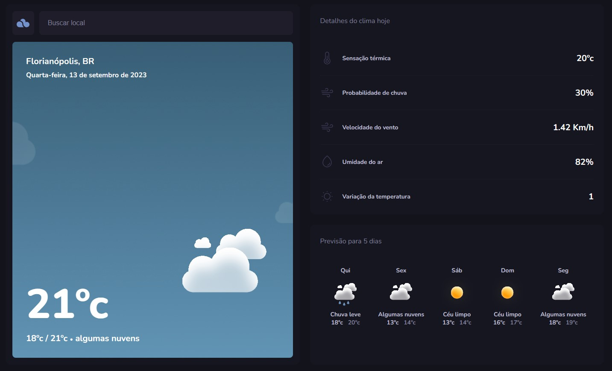

# <h1 align="center">Typeweather</h1>

An app for weather forecasting in TypeScript.

Developed at extra module of the Explorer Course

Deploy https://beamish-froyo-c81155.netlify.app/dashboard 

  

